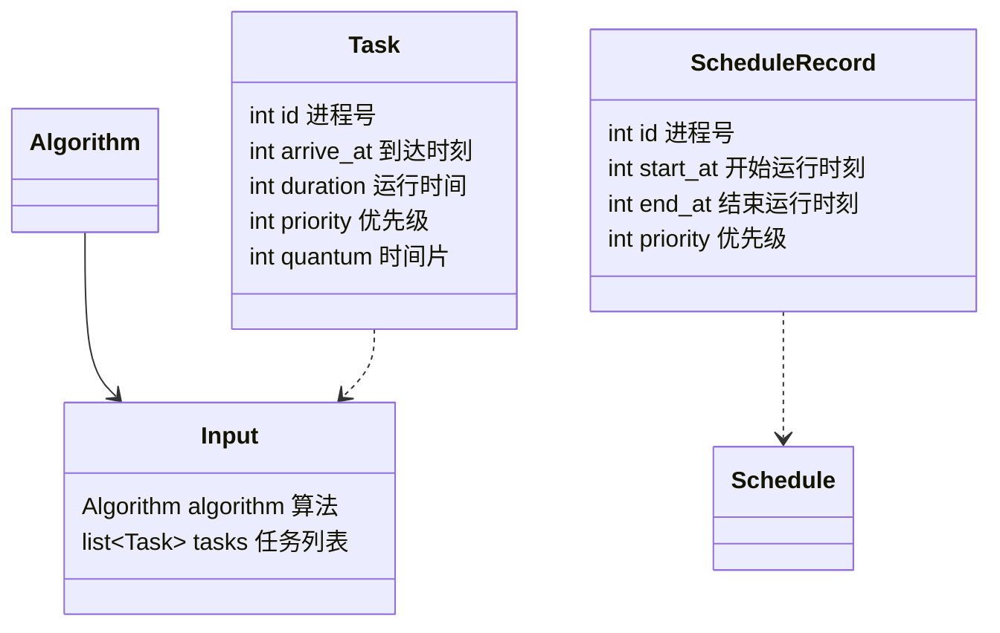
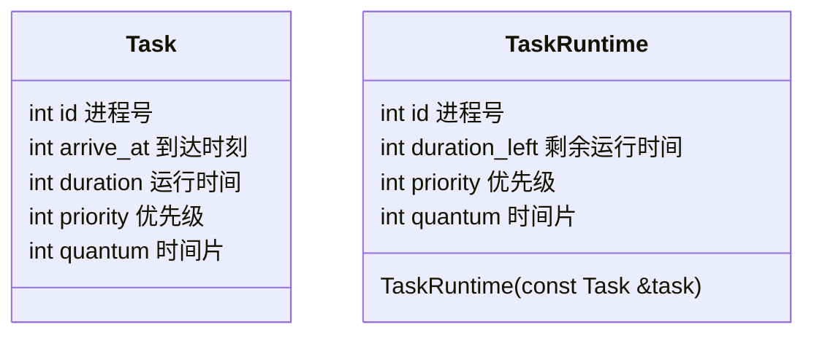
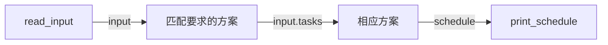
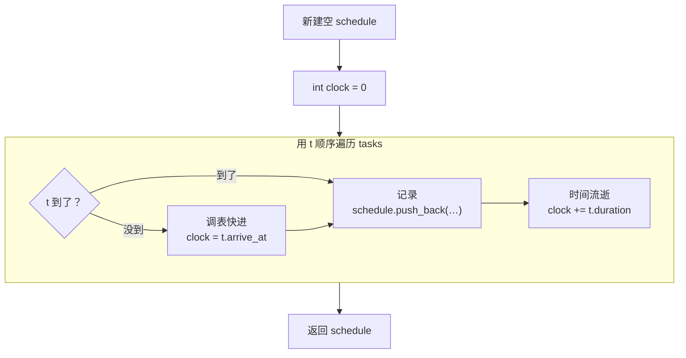
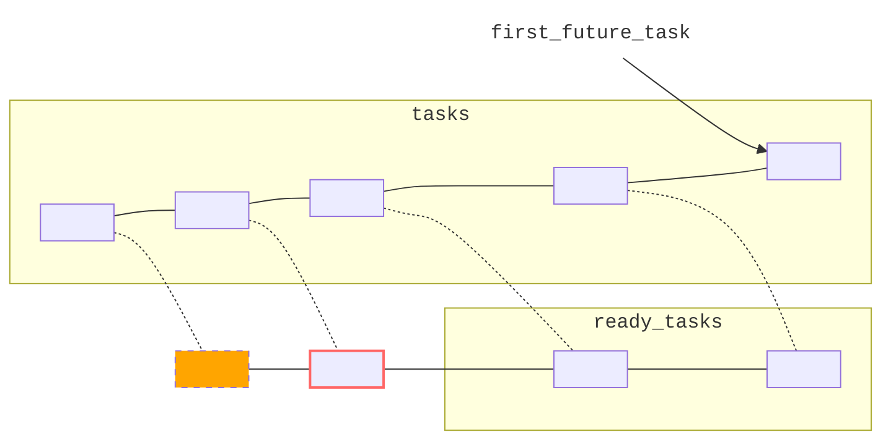
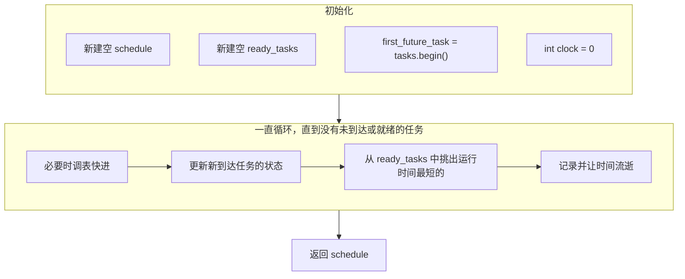

# 实验1 单处理机进程调度

## 实验内容

编写单处理机下的进程调度程序，模拟操作系统对进程的调度。

## 实验目的

进程是操作系统中最基本、最重要的概念，进程调度又是操作系统的核心模块。

本实验要求学生独立设计并实现进程调度模拟程序，以加深对进程控制块概念和各种进程调度算法的理解。

## 实验基础知识

- 进程调度

  对于单核单处理器系统，同时只能有一个进程运行，其它进程必须等到处理器再次空闲，重新调度时才有可能运行。为了充分利用 CPU、缩短进程等待时间、尽快响应新进程，需要特别设计进程调度。

- 典型的进程是 CPU 与输入输出请求交替执行，阻塞（等待输入输出等事件）时 CPU 可以先让其它进程运行。本实验不涉及任何输入输出请求，所有进程都只含 CPU 计算。

- 进程状态

  ```mermaid
  stateDiagram-v2
  direction LR
  
  就绪: 就绪<br>ready
  运行: 运行<br>running
  阻塞: 阻塞<br>blocked
  
  [*] --> 就绪: 创建
  运行 --> 就绪: 中断
  就绪 --> 运行: 调度
  运行 --> 阻塞: 等待事件
  阻塞 --> 就绪: 事件完成
  运行 --> [*]: 终止
  ```

- 调度时机

  只有以下四种情况有可能发生调度，并且前两种必定发生调度。

  - 当前进程发起输入输出请求，或者开始等待别的事件。（运行→阻塞）
  - 当前进程终止。（运行→）
  - 当前进程中断。（运行→就绪）
  - 某个进程就绪。（阻塞→就绪）

  非抢占式方案只在前两种情况调度；抢占（preemptive）式方案则四种都有可能。

  本实验中，“先来先服务”“短作业优先”属于前者，“最短剩余时间”“时间片轮转”“动态优先级”属于后者。另外由于本实验不存在阻塞，非抢占式方案意味着进程一旦开始运行，便会一次运行完。

## 实验设计方法

> 我先写了一个程序；最后发现大段重复，就用 C++ 的各种特性精简合并，重新写了一个，然而代码反而多了一百多行……（语法太繁琐了，`public`之类的就独占十几行。）
>
> 两个程序都正确，思路不太一样，下面分开依次介绍。

### 总体设计

#### 结构

首先针对输入输出设计结构。

> 以下如无说明，皆为`struct`。

- **输入方面**
  
  - 调度算法`Algorithm`。（枚举）
  
  - 任务`Task`：输入的一行。
  
  - 任务列表`list<Task>`：输入的任务列表。
  
    因为长度不定，之后又有可能频繁增删，选用链表`list`。
  
  - 输入`Input`。
  
- **输出方面**
  - 单条执行记录`ScheduleRecord`：输出的一行。
  
  - 执行记录`Schedule`：输出。
  
    因为记录只增不减，可用`vector`。（`Schedule`是`vector<ScheduleRecord>`的别名。）`Schedule`并不显式存储编号，而是用存储位置关系隐含编号。



```c++
/** 调度算法 */
enum Algorithm {
    /** 先来先服务 */
    FirstComeFirstService = 1,
    /** 短作业优先 */
    ShortestJobFirst = 2,
    /** 最短剩余时间优先 */
    ShortestRemainingTimeFirst = 3,
    /** 时间片轮转 */
    RoundRobin = 4,
    /** 动态优先级 */
    DynamicPriority = 5,
};
```

> `○○_at`表示时刻，`duration_○○`表示时间。

在抢占式方案中，任务可能分好几次运行。此时我们只关心“剩余”运行时间（而非“总”运行时间），任务到达时刻也不再重要。因此，另外设计一个`TaskRuntime`记录运行了一半的任务。



#### 功能和流程图



1. **`read_input`**

   1. 从`stdin`读取输入并解析。
   2. 给`tasks`排序：==按到达时间升序排列，同时到达时进程号小的在前。==

   注：实际是边解析，边插入排序，分得没那么清。另外，由于所有测试输入进程号都是从小到大，所以实际用“先输入的在前”代替了“进程号小的在前”。

2. **匹配要求的方案**

   用`switch`–`case`即可。

   如果输入非法，调用`not_implemented()`向`stderr`报错并结束程序。

3. **相应方案**

   ==每种方案一个函数==，将任务列表（`const list<Task> &tasks`）转换为执行计划（`Schedule`）。

   注意`tasks`是`const`，本身并不更改。

4. **`print_schedule`**

   按顺序自动编号，向`stdout`输出。

下面依次介绍五种方案的函数。

### 调度方案设计

都采用时钟（`int clock`）从零开始模拟运行。

#### 1. 先来先服务`first_come_first_service`



`clock`的用处在于记录执行计划，如下。

```c++
schedule.push_back(
    ScheduleRecord(
        t.id,
        clock,
        clock + t.duration,
        t.priority));
```

#### 2. 短作业优先`shortest_job_first`

这种方案中，任务状态变化过程如下。


1. **未到达**：由于`tasks`已按到达顺序排好，用`first_future_task`标记首个未到达的任务即可。
2. **未到达→就绪**：任务到达时，将它复制一下插入`ready_tasks`。
3. **就绪→运行**：轮到它运行时，将它从`ready_tasks`中删除，运行之。
4. **运行→完成**：记录一下，直接丢弃。



程序流程如下。



- **一直循环，直到没有未到达或就绪的任务**：

  不存在“未到达”或“就绪” ⇔ 全都运行过。

- **更新新到达任务的状态**：

  ```c++
  while (first_future_task != tasks.end() && first_future_task->arrive_at <= clock) {
      ready_tasks.push_back(*first_future_task);
      first_future_task++;
  }
  ```

- **从`ready_tasks`中挑出运行时间最短的**：

  1. 擂台法找最小，相同时选靠前的（先来先服务）。

     ```c++
     auto shortest_task = ready_tasks.front();
     for (auto &&t : ready_tasks) {
         if (shortest_task.duration > t.duration) {
             shortest_task = t;
         }
     }
     ```

  2. 在`ready_tasks`中删除它。

     ```c++
     ready_tasks.remove(shortest_task);
     ```

## 实验结果及数据分析

## 总结

## 附录

程序清单及说明。（列出文件名及说明即可，不需要在此处复制代码，代码直接以源文件形式提供，但源文件中对代码要有必要的注释和说明）
