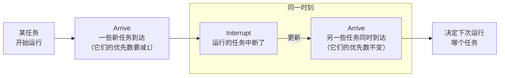
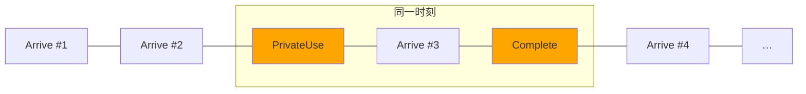

# 实验1 单处理机进程调度

## 实验内容

编写单处理机下的进程调度程序，模拟操作系统对进程的调度。

## 实验目的

进程是操作系统中最基本、最重要的概念，进程调度又是操作系统的核心模块。

本实验要求学生独立设计并实现进程调度模拟程序，以加深对进程控制块概念和各种进程调度算法的理解。

## 实验基础知识

- **进程调度**

  对于单核单处理器系统，同时只能有一个进程运行，其它进程必须等到处理器再次空闲，重新调度时才有可能运行。为了充分利用 CPU、缩短进程等待时间、尽快响应新进程，需要特别设计进程调度。

- 典型的进程是 CPU 与输入输出请求交替执行，阻塞（等待输入输出等事件）时 CPU 可以先让其它进程运行。本实验不涉及任何输入输出请求，所有进程都只含 CPU 计算。

- **进程状态**

  ```mermaid
  stateDiagram-v2
  direction LR
  
  就绪: 就绪<br>ready
  运行: 运行<br>running
  阻塞: 阻塞<br>blocked
  
  [*] --> 就绪: 创建
  运行 --> 就绪: 中断
  就绪 --> 运行: 调度
  运行 --> 阻塞: 等待事件
  阻塞 --> 就绪: 事件完成
  运行 --> [*]: 终止
  ```

- **调度时机**

  只有以下四种情况有可能发生调度，并且前两种必定发生调度。

  - 当前进程发起输入输出请求，或者开始等待别的事件。（运行→阻塞）
  - 当前进程终止。（运行→）
  - 当前进程中断。（运行→就绪）
  - 某个进程就绪。（阻塞→就绪）

  非抢占式方案只存在前两种情况的调度；抢占（preemptive）式方案则四种都有可能。

  本实验中，“先来先服务”“短作业优先”属于前者，“最短剩余时间”“时间片轮转”“动态优先级”属于后者。另外由于本实验不存在阻塞，非抢占式方案意味着进程一旦开始运行，便会一次运行完。

## 实验设计方法

> 我先写了一个程序；最后发现大段重复，就用 C++ 的各种特性精简合并，重新写了一个，然而代码反而多了一百多行……（语法太繁琐了，`public`之类的就独占十几行。）
>
> 两个程序都正确，思路不太一样，下面分开依次介绍。

### 总体设计

#### 结构

首先针对输入输出设计结构。

> 以下如无说明，皆为`struct`。

- **输入方面**
  
  - 调度算法`Algorithm`。（枚举）
  
  - 任务`Task`：输入的一行。
  
  - 任务列表`list<Task>`：输入的任务列表。
  
    因为长度不定，之后又有可能频繁增删，选用链表`list`。
  
  - 输入`Input`。
  
- **输出方面**
  - 单条执行记录`ScheduleRecord`：输出的一行。
  
  - 执行记录`Schedule`：输出。
  
    因为记录只增不减，可用`vector`。（`Schedule`是`vector<ScheduleRecord>`的别名。）`Schedule`并不显式存储编号，而是用存储位置关系隐含编号。


```c++
/** 调度算法 */
enum Algorithm {
    /** 先来先服务 */
    FirstComeFirstService = 1,
    /** 短作业优先 */
    ShortestJobFirst = 2,
    /** 最短剩余时间优先 */
    ShortestRemainingTimeFirst = 3,
    /** 时间片轮转 */
    RoundRobin = 4,
    /** 动态优先级 */
    DynamicPriority = 5,
};
```

> `○○_at`表示时刻，`duration_○○`表示时间。

在抢占式方案中，任务可能分好几次运行。此时我们只关心“剩余”运行时间（而非“总”运行时间），任务到达时刻也不再重要。因此，另外设计一个`TaskRuntime`记录运行了一半的任务。


#### 功能和流程图


1. **`read_input`**

   1. 从`stdin`读取输入并解析。
   2. 给`tasks`排序：==按到达时间升序排列，同时到达时进程号小的在前。==

   注：实际是边解析，边插入排序，分得没那么清。另外，由于所有测试输入进程号都是从小到大，所以实际用“先输入的在前”代替了“进程号小的在前”。

2. **匹配要求的方案**

   用`switch`–`case`即可。

   如果输入非法，调用`not_implemented()`向`stderr`报错并结束程序。

3. **相应方案**

   ==每种方案一个函数==，将任务列表（`const list<Task> &tasks`）转换为执行计划（`Schedule`）。

   注意`tasks`是`const`，本身并不更改。

4. **`print_schedule`**

   按顺序自动编号，向`stdout`输出。

下面依次介绍五种方案的函数。

### 调度方案设计

都采用时钟（`int clock`）从零开始模拟运行。

#### 1. 先来先服务`first_come_first_service`


`clock`的用处在于记录执行计划，如下。

```c++
schedule.push_back(
    ScheduleRecord(
        t.id,
        clock,
        clock + t.duration,
        t.priority));
```

#### 2. 短作业优先`shortest_job_first`

这种方案中，任务状态变化过程如下。


1. **未到达**：由于`tasks`已按到达顺序排好，用`first_future_task`标记首个未到达的任务即可。
2. **未到达→就绪**：任务到达时，将它复制一下插入`ready_tasks`。
3. **就绪→运行**：轮到它运行时，将它从`ready_tasks`中删除，运行之。
4. **运行→完成**：记录一下，直接丢弃。


程序流程如下。

> 橙色部分表示与前面不同，后同。


- **一直循环，直到没有未到达或就绪的任务**：

  不存在“未到达”或“就绪” ⇔ 全都运行过。

- **更新新到达任务的状态**：

  ```c++
  while (first_future_task != tasks.end() && first_future_task->arrive_at <= clock) {
      ready_tasks.push_back(*first_future_task);
      first_future_task++;
  }
  ```

- **从`ready_tasks`中挑出运行时间最短的**：

  1. 擂台法找最小，相同时选靠前的（先来先服务）。

     ```c++
     auto shortest_task = ready_tasks.front();
     for (auto &&t : ready_tasks) {
         if (shortest_task.duration > t.duration) {
             shortest_task = t;
         }
     }
     ```

  2. 在`ready_tasks`中删除它。

     ```c++
     ready_tasks.remove(shortest_task);
     ```

#### 3. 最短剩余时间优先`shortest_remaining_time_first`

从这一方案起，全都属于抢占式。任务可能分多次运行，`ready_tasks`要从`list<Task>`改为`list<TaskRuntime>`。

仍旧采用`first_future_task`加`ready_tasks`的模式，只是要同时维护`duration_left`。


- **`handle_tasks_arrival`**

  相当于原来的“必要时调表快进”和“更新新到达任务的状态”，只是整理成了函数。

- **计算运行时间**

  由于可抢占，任务不一定依次运行完，可能中途被强占，导致这次运行时间小于任务本身剩余运行时间。

  ```c++
  int duration = shortest_task.duration_left;
  if (first_future_task != tasks.end()) {
      duration = min(duration, first_future_task->arrive_at - clock);
  }
  ```

- **记录并让时间流逝**

  - 记录

    - 若上次记录（若有）和这次是同一任务，直接修改上次记录。
    - 否则在`schedule`末尾追加记录。

    这种奇怪操作在五种方案中独一无二。如果一个任务运行中途另一任务到达，需比较才知是否能抢占，即“调度”了一下。然而根据所给测试用例，这不算调度，前后两段要输出成一段。

  - 让时间流逝

    除了`clock += duration`，还要更新任务的剩余运行时间：`shortest_task.duration_left -= duration`。

- **压回`ready_tasks`**

  要压到`ready_tasks`末尾，这样保证“从`ready_tasks`中挑出`duration_left`最短的”时，若剩余时间相同，能挑出先来的。

#### 4. 时间片轮转`round_robin`

仍旧采用之前模式。


- **`handle_tasks_arrival`**

  内容与前面相同，只是位置变了。原来是在<u>上一轮</u>的“压回`ready_tasks`”<u>之后</u>，现在是在<u>这一轮</u>的“压回`ready_tasks`”<u>之前</u>。

  这是为了满足实验要求：任务回到`ready_tasks`时，要排到它运行时新到达的任务之后。

- **从`ready_tasks`中挑出开头的**

  无需花 $\order{n}$ 找，第一个便是要运行的。

- **计算运行时间**

  ```c++
  int duration = min(next_task.duration_left, next_task.quantum);
  ```

#### 5. 动态优先级`dynamic_priority`

实验要求这里描述得较模糊，先重新阐释一下。

- 每次调度时选择运行的顺序：小优先数 → 早到达 → 小进程号。

  由于我`read_input`时已经按“早到达 → 小进程号”排好，遇到相同优先数，直接取靠前的即可。

- 指定初始优先数。

- 任务每运行一个时间片，优先数加3。

- 任务每在就绪队列中每停留一个时间片，优先数减1。

  不完整的时间片也算一个。换句话说，在时间片中途到达的任务，初次调度时优先级可能就已经变了。

- 优先数最小是零。

现在来看设计。仍旧采用`first_future_task`加`ready_tasks`的模式。下面是具体流程。


- **处理新到达的任务**

  与原来的`handle_tasks_arrival`相同，但对于那些中途到达的任务，要先更新一次优先级。

  ```c++
  if (first_future_task->arrive_at < clock) {
      new_task.priority = max(new_task.priority - 1, 0);
  }
  ```

  注意这个`if`条件是严格不等号；而外层`while`条件和原来一样，仍是不严格的。

- **在`ready_tasks`中选择`priority`最小的**

  从“挑出”变成了“选择”。具体来说，运行任务前不再删除任务等后续加回，而是直接在原地操作，必要再删除。

  这样可以保持`ready_tasks`一直按“早到达 → 小进程号”排好，方便查找要运行的程序。

- **更新优先级**

  由于实验要求`schedule`中优先级是更新过的，所以要在“运行”开头更新。

  ```c++
  next_task->priority += 3;
  for (auto &&t : ready_tasks) {
      if (t != *next_task) {
          t.priority = max(t.priority - 1, 0);
      }
  }
  ```

## 实验结果及数据分析

### 乐学

全都通过了。


### 自己测试

测试了好多，这里只放调试最久的动态优先级的一个例子。

下图中，横坐标表示时刻，纵坐标对应任务编号；菱形表示到达（输入），矩形表示运行（输出）；菱形、矩形上的数字是当时的优先数；时间片为 40 ms（输入）。


- 0 ms：只有任务 #4 到达了，故把 CPU 调度给他——未到达的任务不影响调度。
- 40 ms：此时任务 #4 的优先数为 33，#5为 28，调度给小的，即 #5。
- 230 ms：此时 #4 和 #1 的优先数都是 28，但 #4 比 #1 早到，所以调度给 #4。
- 570 ms：#1 只运行了 20 ms，因为用不完一整个时间片（40 ms）就完成了。

## 实验设计方法 2

### 重新分析

由于这里所有进程都仅有一段 CPU 计算，不会出现中断，可忽略“等待”，从而简化进程状态。

如下图，这里只采用`ready`、`running`两种状态，能触发三种事件引起调度，调度时会把某个进程从`ready`转为`running`。


相应建立`enum EventType`，包括`Arrive`、`Interrutpe`、`Complete`三种事件，再加上`PrivateUse`供某些特殊场景。

另外，这里的事件不可取消（一旦加入`events`，就不允许再删除）。

### 总体设计

大致思想是用类的继承、虚函数去除重复代码，同时使用事件循环替代初版各种`while`。

沿用`Algorithm`、`Task`、`TaskRuntime`，`SchedulerRecord`更名为`Record`，`Schedule`更名为`Plan`（以与下面的`Scheduler`区分）。尽量用迭代器替代引用，`list<TaskRuntime>::iterator`简称`TaskRuntimeIterator`。

首先规定`struct Event`，如下。其中`task_id`只适用于`Arrive`事件，其它时候都是`NOT_APPLICABLE`（`#define`的常量）。


接着是那些调度器类。


> - 所有任务`tasks`。
> - 就绪和运行的任务`working_tasks`：默认还按“早到达 → 小进程号”排好，除非有特殊需要。
> - 正在运行的任务`running_task`：总是`working_tasks`中的一项；若无人运行，为`working_tasks.end()`。
> - 未来的事件`events`：始终按发生顺序排列。
> - `get_task()`：从`tasks`中获取任务并转换为`TaskRuntime`。


### 调度方案设计

#### 一般调度器`Scheduler`

- **构造函数**

  - 所有任务都未到达：`working_tasks`为空，`running_task`为`end`。
  - 无事件：`events`为空。

- **运行`run()`**

  新建空`plan`，登记所有任务的`Arrive`事件。然后逐一用`handle_event`处理`events`。最后返回`plan`。

  ```c++
  Plan plan = Plan();
  register_arrivals();
  
  while (!this->events.empty()) {
      auto event = this->events.front();
      this->events.pop_front();
  
      handle_event(event, plan);
  }
  
  return plan;
  ```

- **处理事件`handle_event(event, plan)`**

  用`switch`–`case`根据`event.type`调用相应`on_○○(event, plan)`。

  `on_○○(…)`可能增删`working_tasks`、修改`running_task`、向`events`登记事件。

  下面是个例子。

  1. `run`处理`Arrive #1`时，从`events`中弹出`Arrive #1`，调用`handle_event`。
  2. 它又转给`on_arrive`。
  3. `on_arrive`将`#1`添加进`working_tasks`。
  4. 它发现没有别人，就直接运行之，用`running_task`指向它，同时又在适当时刻登记`Complete`事件，如下。

     ```c++
     this->register_event(Event(EventType::Complete, end_at, NOT_APPLICABLE));
     ```

  ```mermaid
  flowchart TB
  subgraph events
      1[Arrive #1]:::delete --- 2[Arrive #2] x-.-x 3[Arrive #3] --- etc["…"]
      2 -.- Complete:::new -.- 3
      1 ==> Complete
  end
  
  classDef new fill: orange
  classDef delete stroke-dasharray: 5 5
  ```

- **登记事件`register_event(event)`**

  向`events`中插入事件，保持`events`按发生顺序排列，且同时发生时，后插入的在后。

#### 先来先服务`SchedulerFCFS`

 `Scheduler`的默认实现便是`SchedulerFCFS`。

- **`on_arrive`**

  1. `get_task`：从`tasks`中找出到达的任务（并转换为`TaskRuntime`）。
  2. 加入`working_tasks`末尾。
  3. 如果当前无人运行（`this->nothing_running()`），立即发起一次调度（调用`on_interrupt`）。

- **`on_complete`**

  1. 从`working_tasks`中删除之前运行的任务。
  2. 清空`running_task`（指向`this->working_tasks.end()`。
  3. 立即发起一次调度。

- **`on_interrupt`**

  1. 若无人可运行（`working_tasks`空），清空`running_task`，直接返回。（`run`回处理下次`Arrive`事件）

  2. 选择`working_tasks`开头，运行（用`running_task`指向）并记录（`plan.push_back(Record(…))`）之。

     > 因为`working_tasks`默认按“早到达 → 小进程号”排好。

  3. 登记它的`Complete`事件。

#### 短作业优先`SchedulerSJF`

只需将`working_tasks`的顺序从“早到达 → 小进程号”改为“小运行时间 → 早到达”。

- **`on_arrive`**

  1. （同前）`get_task`。

  2. 插入`working_tasks`，同时保持其顺序。

     ```mermaid
     flowchart
     init["where = working_tasks.begin()"]
     --> check{"where ≠ end ∧<br>where 的剩余时间<br>比 task 小"}
     -->|是| increment[++where] --> check
     check -->|否| insert["working_tasks.insert(where, task)"]
     ```

  3. （同前）如果当前无人运行，立即发起一次调度。

可以看到，这一版本干净利落地实现了两种非抢占式方案。

#### 抢占式方案`SchedulerPreemptive`

抢占式方案稍微复杂一些，有一些共同的东西可以抽象出来。

- **`on_interrupt`**

  1. **`handle_last_running_task`**

     抢占式方案中任务可以分多次运行，中断时有些收尾工作要做，例如调整`working_tasks`的顺序。

  2. （同前）**若无人可运行，直接返回。**

  3. **从`working_tasks`中选择要运行的任务。**（`next_task_to_run`）

     ```c++
     this->running_task = this->next_task_to_run();
     ```

  4. **计算运行时间。**（`can_run_for`）

     因为可抢占，每次运行时间不一定是总运行时间。

     ```c++
     const auto duration = this->can_run_for(event.at);
     ```

  5. **记录并让时间流逝。**（`record_running_task`）

     ```c++
     this->running_task->duration_left -= duration;
     
     auto end_at = event.at + duration;
     this->record_running_task(plan, event.at, end_at);
     ```

  6. 根据情况，**登记它的`Complete`或`Interrupt`事件**。

#### 最短剩余时间优先`SchedulerShortestRemainingTimeFirst`

- **`next_task_to_run`**

  花 $\order{n}$ 找出`duration_left`最小的。若相等，取靠前的。

  因为`working_tasks`保证按“早到达 → 小进程号”排序。

- **`can_run_for(now)`**

  最长运行到下次`Arrive`事件（如果有）。

  ```mermaid
  flowchart
  init["next_arrival = events.begin()"]
  -->  while
  
  subgraph while["循环：next_arrival ≠ end ∧ next_arrival 不是 Arrive 事件"]
      ++next_arrival
  end
  
  while --> if{next_arrival == end}
  -->|是| return_1["return running_task→duration_left"]
  if -->|否| return_2["return min(running_task→duration_left,<br> next_arrival→at - now)"]
  ```

- **`record_running_task(plan, start_at, end_at)`**

  这种方案有个独一无二的奇怪操作，见初版程序部分。

  ```c++
  if (!plan.empty() && this->running_task->id == plan.back().id) {
      plan.back().end_at = end_at;
  } else {
      SchedulerPreemptive::record_running_task(plan, start_at, end_at);
  }
  ```

#### 时间片轮转`SchedulerRoundRobin`

- **`can_run_for(now)`**

  最长运行完时间片。

- **`handle_last_running_task`**

  1. 将`running_task`移到末尾。

     ```c++
     if (this->running_task != this->working_tasks.end()) {
         this->working_tasks.splice(this->working_tasks.end(), this->working_tasks, this->running_task);
     }
     ```

     注意如果同一时刻发生`Arrive`和`Interrupt`，会先处理`Arrive`，因为它比`Interrupt`先进入`events`。（`Arrive`在`run`开头进入，`Interrupt`在事件循环中进入。）于是天然保证了要求：“任务回到`ready_tasks`时，要排到它运行时新到达的任务之后。”

  2. 清空`running_task`。

可以看到，这一版本又同样轻巧地实现了两种抢占式方案。

#### 动态优先级`SchedulerDynamicPriority`

这种方案实现得最复杂，因为实验要求比较拧巴。不过我们先看简单的——这一版程序的好处就是允许一部分一部分构思，而非一大坨一大坨得写。

- **`next_task_to_run`**

  花 $\order{n}$ 找出`priority`最小的。若相等，取靠前的。

  因为`working_tasks`保证按“早到达 → 小进程号”排序。

- **`can_run_for`**

  （同前）最长运行完时间片。

- **`record_running_task`**

  记录前要把`running_task`的优先数加三。

下面来处理拧巴的部分。



理想时间线如上，我们要在“更新”处更新优先级。然而这不可能！同时发生时，`Arrive`总是比`Interrupt`先被处理。

因此，这里引入一种新事件（`PrivateUse`）专门减那些优先数。这种设计下典型的`events`如下。



- **`handle_event(event, plan)`**

  ```mermaid
  flowchart
  type{event.type}
  -->|PrivateUse| 给所有就绪任务的优先数减一:::diff
  type -->|其它| parent[调用原来的 handle_event]
  
  classDef diff fill: orange
  ```

  注意减一不能减到负，可用`max(_, 0)`限制。

  ```c++
  for (auto &&t : this->working_tasks) {
      if (t != *this->running_task) {
          t.priority = max(t.priority - 1, 0);
      }
  }
  ```

- **`register_event(event)`**

  若涉及前述矛盾，悄悄补一个`PrivateUse`事件。

  ```mermaid
  flowchart
  type{event.type}
  -->|Complete 或 Interrupt| insert[在同一时刻 Arrive 事件前插入 PrivateUse]:::diff
  --> parent[调用原来的 register_event]
  
  type -->|其它| parent
  
  classDef diff fill: orange
  ```

至此，虽然比较魔幻，但还勉强算简单地实现了动态优先级方案。

## 实验结果及数据分析 2

> 乐学太慢了，直接在本地用`judger`和初版程序比较的。

### 自己测试

全都通过了。


## 总结

- 调试工具很重要。

  一开始 Wrong Answer 时就硬看，实在受不了……然后用 VS Code 的比较功能（如下图），好一点~儿~，但还是不容易搞清关系。最后做了`draw_gantt.py`，很舒适。

  

- 区分传值和传引用。

  `ready_tasks.front()`虽然返回`TaskRuntime &`，但`auto t = ready_tasks.front()`（而非`auto &`）的`t`仍然是`TaskRuntime`。因而修改`t.priority`不会影响`ready_tasks`里的优先级。

  我这次最后采用`auto t = ready_tasks.begin()`，`t`是`list<TaskRuntime>::iterator`，肯定能修改原链表里的优先级。这样还可用`erase`替代`remove`，从而避免大量比较。（不过没有太大影响）

- 代码本身就暗示了极端情况。

  例如一写下`auto shortest_task = ready_tasks.front()`，就要想想`ready_tasks`空不空。

## 附录

### 程序清单及说明

- `draw_gantt.py`：绘制 Gantt 图。
- `ex_1-event.cpp`：去除重复代码的版本。
- `ex_1.cpp`：初次写的版本。
- `ref.py`：从[网上找的（部分）正确程序](https://www.jianshu.com/p/6e415fdce561)的节选，用于反推实验要求。
- `/judger/src/`
  - `lib.rs`：解析参数、用测试用例检查程序。
  - `main.rs`：CLI。
  - `run.rs`：较底层的运行。

### `draw_gantt.py`使用示例

```powershell
> ./draw_gantt.py
algorithm id >> 5
tasks >>
1/200/100/29/40
……
5/40/170/28/40
^Z
schedule >>
1/4/0/40/33
……
17/4/580/620/33
^Z
gantt
dateFormat SSS
axisFormat %L ms

section 1
29: milestone, 200, 0
30: 270, 310

……

section 5
……
33: 570, 580

I've copied to your clipboard. Try to paste it to https://mermaid.live/ .
```

> `^Z`是<kbd>Ctrl</kbd>+<kbd>Z</kbd>。
