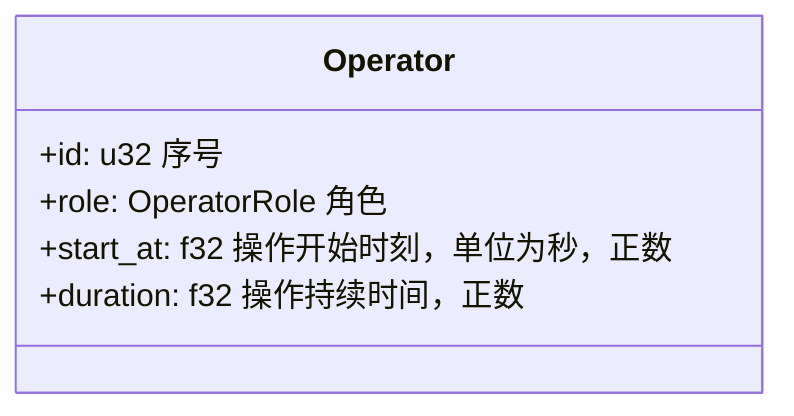
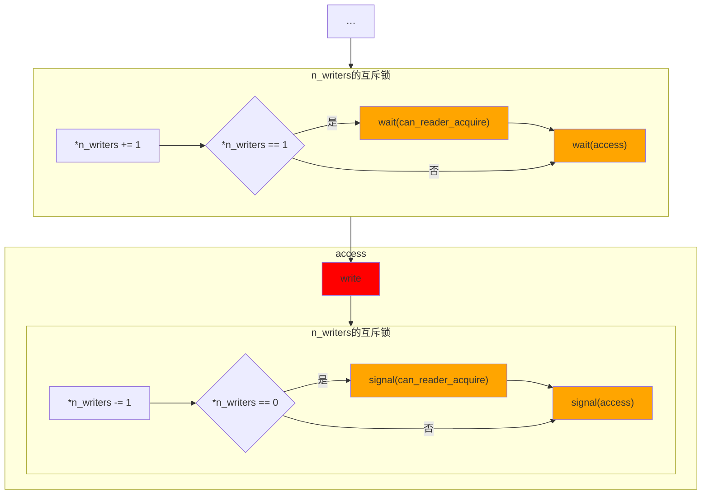
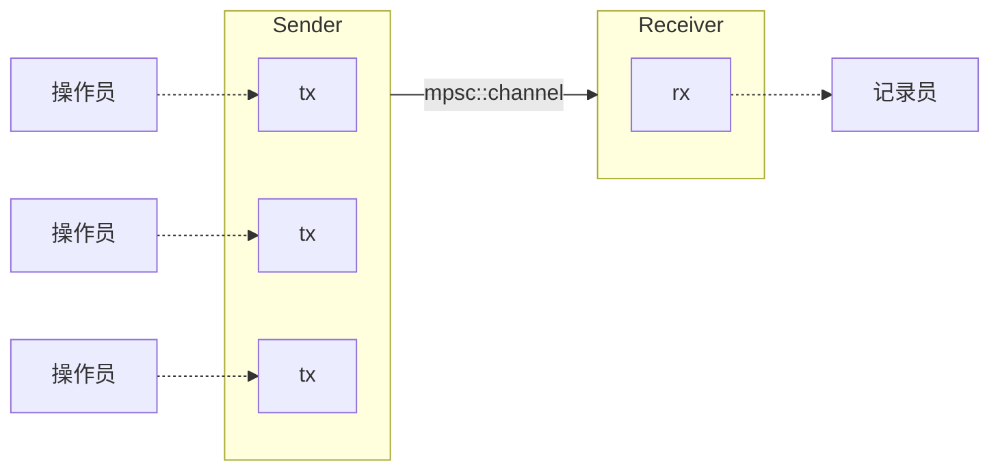
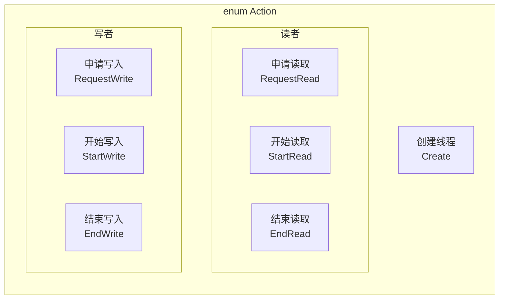
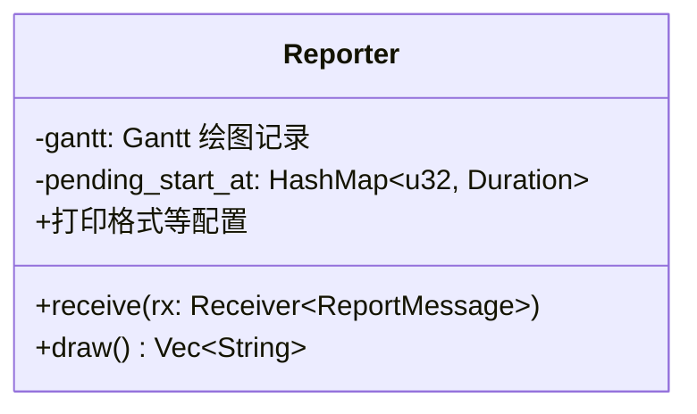
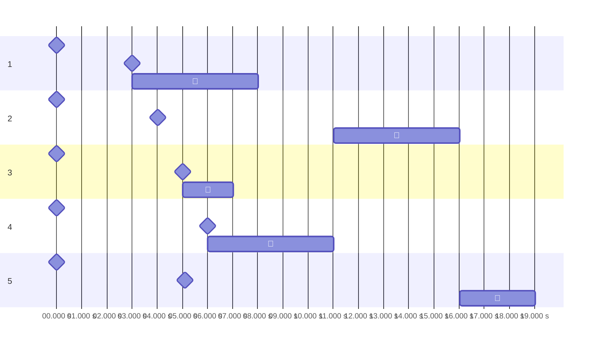
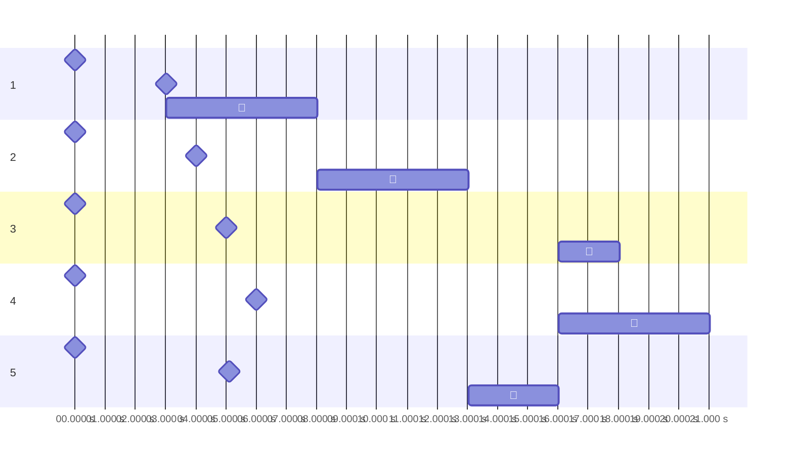
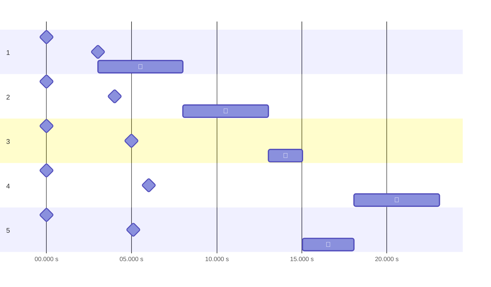
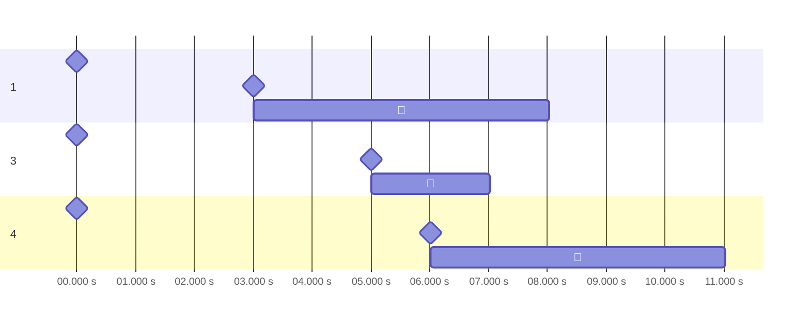

# 实验2 读者写者问题

## 实验内容

在Windows环境下，创建一个控制台进程，此进程包含n个线程。用这n个线程来表示n个读者或写者。每个线程按输入的要求进行读写操作。用信号量机制分别实现读者优先和写者优先问题。

运行结果显示要求：要求在每个线程创建、发出读写申请、开始读写操作和结束读写操作时分别显示一行提示信息，以确定所有处理都遵守相应的读写操作限制。

## 实验目的

1. 通过编写和调试程序以加深对进程、线程管理方案的理解。
2. 熟悉Windows多线程程序设计方法。

## 实验基础知识

> 以下很多地方的“线程”换成“进程”同样适用，甚至更合理。不过这次实验是多线程，所以都写的是“线程”。

### 同步问题

多个线程可能希望协作使用同一资源，需要尽可能实现互斥使用、有空让进、优先等待。

### 信号量

信号量（semaphore）用于解决同步问题，代表可用的资源。

具体来说，信号量包括一个整数，涉及如下两种原子操作。

```rust
/// 等待空闲资源并获取
fn wait(semaphore) {
    semaphore.value -= 1;
    if semaphore.value < 0 {
        // 若无可用资源，等待别人用完通知
        semaphore.list.push(this_process);
        sleep();
    }
}

/// 释放资源并通知他人可以利用
fn signal(semaphore) {
    semaphore += 1;
    if semaphore.value <= 0 {
        let process = semaphore.list.pop();
        wake_up(process);
    }
}
```

在多个线程各自`wait`、`signal`同一公用信号量，可以解决同步问题。在每一线程先后`wait`、`signal`同一私用信号量，可以解决互斥问题。

### 读者—写者问题

读者—写者问题读写操作的通用限制：

- 写—写互斥：不能有两个写者同时进行写操作。

- 读—写互斥：不能同时有一个线程在读，而另一个线程在写。

- 读—读允许：可以有一个或多个读者在读。

附加限制：

- **读者优先**：读者申请时，只要已有其它读者正在读，则它可直接开始操作，不理会写者的请求。
- **写者优先**：一旦有写者申请，任何新读者都必须先等待。
- **公平竞争**：所有操作者都要在`service`的等待队列中排队，从而保证公平。

## 实验设计方法

> 另请参阅自动生成的文档：`cargo doc --open`或手动打开`target/doc/ex_2/index.html`。那里会有更细节的东西，比如`id`存储时是用多少位整数。

### 操作员`Operator`（`operator.rs`）

#### 结构

针对输入设计`Operator`操作员。（如下



其中角色`role: OperatorRole`如下。

```rust
#[derive(Debug, PartialEq)]
pub enum OperatorRole {
    Reader,
    Writer,
}
```

#### 功能

- `Operator::from(line: &str) -> Result<Operator, OperatorParseError>`

  将字符串（如`"1 R 3.3 5"`）解析为`Operator`。

  > 解析字符串要干很多琐碎的事，抛出各种错误（`enum OperatorParseError`）。然而没太大关系，就不多介绍了。

- `ready_inputs() -> Vec<Operator>`

  从 stdin 读取若干行，解析为`Operator`列表。

### 同步方案`run_○○(…)`（`solutions.rs`）

每种同步方案写成一个函数。

- **输入**：操作员列表（`operators: Vec<Operator>`）。

- **功能**：

  1. 建立同步手段（信号量等）。

  2. 让每位操作员在一个线程运行。

     （运行时并不真的读写文件，只是用`thread::sleep`模拟）

  3. 等待所有操作员结束。

- **没有的功能**：打印运行记录。

  `run_○○()`会向外发送消息（`tx.send((…))`）来传递运行记录，把这些记录打印出来是`Reporter`的工作。

  > 实际上`run_○○()`还需要另一参数接入管道——`tx: Sender<ReportMessage>`。这些东西会在`Reporter`一节介绍。

#### 读者优先方案`run_read_preferring`

读者申请时，只要已有其它读者正在读，则它可直接开始操作，不理会写者的请求。

##### 原理

1. 由于互斥访问（读者团体—写者、写者—另一写者），需用**信号量`access`**表示文件的读写权。

   谁占有`access`（把`acess`改成假），谁就能操作文件。

   初始时，所有人都可随时夺权，因此取真。

   ```rust
   let access = Arc::new((Mutex::new(true), Condvar::new()));
   ```

   > 关于信号量为什么写成这样，会在`Semaphore`一节介绍。

2. 读者作为一个团体和其他人互斥，团体内部可允许同时访问。因此，团体中第一人夺权，最后一人放权。

   由于“第一人”和“最后一人”往往不是同一人，必须操作员间通信才能实现，故设置**计数器`n_readers`**记录当前**正在访问的读者**数量。

   初始时，无读者在访问，取零。

   ```rust
   let mut n_readers = 0; // 部分正确
   ```

3. 读者整个团体要共同维护`n_readers`一个变量，必须互斥访问。

   这里使用**互斥锁`Mutex`**实现。上一行修改如下。

   ```rust
   let n_readers = Arc::new(Mutex::new(0));
   ```

4. 现在**检查**一下读者是否真的优先。

   读者申请时，只要已有其它读者正在读，就说明读者团体已经把`access`夺了，则它可直接开始操作，不理会写者的请求。

   而写者申请时，夺到`access`前必须等整个读者团体放权，即所有读者都读完了。

##### 实现

- **总体**

  ```mermaid
  flowchart TB
  subgraph 初始化
      direction TB
      init_access["access = Semaphore(true)"]
      init_n["n_readers = Mutex(0)"]
      %% init_now["now = Instant::now()"]
  end
  
  初始化 --> for
  
  subgraph for["for o in operators"]
      match[o.role]
      -->|Reader| spawn_r[新建读者线程]
      match -->|Writer| spawn_w[新建写者线程]
  end
  ```

  > 因为操作员会向主线程的`Reporter`发送运行记录，主线程天然会等待这些线程，无需`join`。

  大架子都是这一套，后面就不重复了。

- **写者**

  ```mermaid
  flowchart LR
  create --> sleep["sleep(o.start_at)"]
  --> wait["wait(access)"]:::sema
  --> write:::crit
  --> signal["signal(access)"]:::sema
  
  subgraph access
      write
      signal
  end
  
  classDef crit fill: red;
  classDef sema fill: orange;
  ```

  > 这一节会展示流程图怎么对应到代码，之后就不展示了。

  ```rust
  thread::spawn(move || {
      tx.send((o.id, Action::Create, now.elapsed())).unwrap();
      // ↑ 向外发送运行记录，后同。
  
      thread::sleep(Duration::from_secs_f32(o.start_at));
  
      tx.send((o.id, Action::RequestWrite, now.elapsed()))
          .unwrap();
      wait(&*access);
  
      tx.send((o.id, Action::StartWrite, now.elapsed())).unwrap();
      thread::sleep(Duration::from_secs_f32(o.duration));
      tx.send((o.id, Action::EndWrite, now.elapsed())).unwrap();
  
      signal(&*access);
  })
  ```

- **读者**

  ```mermaid
  flowchart TB
  create --> sleep["sleep(o.start_at)"]
  --> enter
  --> write:::crit
  --> exit
  
  subgraph enter["n_readers的互斥锁"]
      increase["*n_readers += 1"]
      --> if_first{*n_readers == 1}
      -->|是| wait["wait(access)"]:::sema
  end
  
  subgraph exit["n_readers的互斥锁"]
      decrease["*n_readers -= 1"]
      --> if_last{*n_readers == 0}
      -->|是| signal["signal(access)"]:::sema
  end
  
  classDef crit fill: red;
  classDef sema fill: orange;
  ```

  ```rust
  thread::spawn(move || {
      tx.send((o.id, Action::Create, now.elapsed())).unwrap();
  
      thread::sleep(Duration::from_secs_f32(o.start_at));
  
      tx.send((o.id, Action::RequestRead, now.elapsed())).unwrap();
      {
          let mut n_readers = n_readers.lock().unwrap();
          *n_readers += 1;
  
          // if I am the first
          if *n_readers == 1 {
              wait(&*access);
          }
      }
  
      tx.send((o.id, Action::StartRead, now.elapsed())).unwrap();
      thread::sleep(Duration::from_secs_f32(o.duration));
      tx.send((o.id, Action::EndRead, now.elapsed())).unwrap();
  
      {
          let mut n_readers = n_readers.lock().unwrap();
          *n_readers -= 1;
  
          // if I am the last
          if *n_readers == 0 {
              signal(&*access);
          }
      }
  })
  ```

#### 写者优先方案`run_write_preferring`

一旦有写者申请，任何新读者都必须先等待。

##### 原理

1. 同前，设计信号量`access`、计数器`n_readers`、`n_readers`的互斥锁。

2. 新读者有时要因写者而等待，这涉及通信，肯定要另设计**信号量`can_reader_acquire`**。

   > 在我的程序中，request 对应整个申请权限的过程，acquire 表示申请`access`。如果对外封装，那么看得到 request，看不到 acquire。

   初始时，无写者，读者总可申请，因此取真。

   ```rust
   let can_reader_acquire = Arc::new((Mutex::new(true), Condvar::new()));
   ```

3. 存在写者等待时，新读者要延后申请`access`，否则无需。“存在等待写者与否”说明需设置**计数器`n_writers`**记录当前**正在等待或访问的写者**数量。

   注意`n_writers`也算那些正在等`access`的写者，而`n_readers`不计。事实上由于读者团体内部不互斥，他们根本不存在“等`access`”这一状态。

   初始时无写者，为零。

4. 同理，`n_writers`也需要**互斥锁**。

   ```rust
   let n_writers = Arc::new(Mutex::new(0));
   ```

5. 怎样将“存在等待写者与否”转换为`can_reader_acquire`？有写者等待或访问时，把`can_reader_acquire`抢走（副作用：改为`false`）。也就是说，第一位写者来时`wait`（阻塞所有新读者），最后一位走时`signal`（通知新读者可以申请`access`）。

##### 实现

- **总体**

  ```mermaid
  flowchart LR
  subgraph 初始化
      direction LR
      init_access["access = Semaphore(true)"]
      init_n["n_readers = Mutex(0)"]
      n_w["n_writers = Mutex(0)"]
      can["can_reader_acquire = Semaphore(true)"]
  end
  
  初始化 --> ell["…"]
  ```

- **写者**

  ```mermaid
  flowchart TB
  create --> sleep["sleep(o.start_at)"]
  --> enter
  --> wait["wait(access)"]:::sema
  --> write:::crit
  --> signal["signal(access)"]:::sema
  --> exit
  
  subgraph access
      write
      signal
  end
  
  subgraph enter["n_writers的互斥锁"]
      increase["*n_writers += 1"]
      --> if_first{*n_writers == 1}
      -->|是| wait_can["wait(can_reader_acquire)"]:::sema
  end
  
  subgraph exit["n_writers的互斥锁"]
      decrease["*n_writers -= 1"]
      --> if_last{*n_writers == 0}
      -->|是| signal_can["signal(can_reader_acquire)"]:::sema
  end
  
  classDef crit fill: red;
  classDef sema fill: orange;
  ```

- **读者**

  ```mermaid
  flowchart TB
  create --> sleep["sleep(o.start_at)"]
  --> wait_can["wait(can_reader_acquire)"]:::sema
  --> enter
  --> signal_can["signal(can_reader_acquire)"]:::sema
  --> write:::crit
  --> exit
  
  subgraph enter["n_readers的互斥锁"]
      increase["*n_readers += 1"]
      --> if_first{*n_readers == 1}
      -->|是| wait["wait(access)"]:::sema
  end
  
  subgraph can_reader_acquire
      enter
      signal_can
  end
  
  subgraph exit["n_readers的互斥锁"]
      decrease["*n_readers -= 1"]
      --> if_last{*n_readers == 0}
      -->|是| signal["signal(access)"]:::sema
  end
  
  classDef crit fill: red;
  classDef sema fill: orange;
  ```

##### 一个错误实现及解决

我一不小心就死锁了……当时一个写者（#2）结束后，无法通知下一写者（#5）开始写入。

```powershell
> cat .\test_cases\mixed.in | cargo run -- write-preferring --tab 10
 0.000 s |          #1：🚀创建。
 0.000 s |                    #2：🚀创建。
 0.000 s |                              #3：🚀创建。
 0.000 s |                                        #4：🚀创建。
 0.000 s |                                                  #5：🚀创建。
 3.004 s |          #1：🔔👀申请读取。
 3.005 s |          #1：🏁👀开始读取。
 4.021 s |                    #2：🔔📝申请写入。
 5.010 s |                              #3：🔔👀申请读取。
 5.110 s |                                                  #5：🔔📝申请写入。
 6.020 s |                                        #4：🔔👀申请读取。
 8.024 s |          #1：🛑👀结束读取。
 8.025 s |                    #2：🏁📝开始写入。
13.030 s |                    #2：🛑📝结束写入。
# 运行到这里应该让 #5 开始写入，但实际会卡住。
```

当时的写者线程如下。



现在的写者准备退出时，下一个写者（#5）已经拿着（第一段）`n_writers`的锁在`wait(access)`，可现在的写者（#2）不拿到（第二段）`n_writers`的锁就无法`signal(access)`。于是卡住了。


解决办法：

- 将`wait(access)`向后挪出`n_writers`的锁。
- 将`signal(access)`向前挪出`n_writers`的锁。

执行任意一种办法即可打破死锁，最后我两种都采取了。

> 我当时先试验出解决办法（尽量让`wait`、`signal`顺序相反），然后才反应过来怎么回事……

#### 公平竞争`run_unspecified_priority`

所有操作员都要一起排队，从而保证公平。

##### 原理

1. 同前，设计信号量`access`、计数器`n_readers`、`n_readers`的互斥锁。

2. 所有操作员排的队是一个信号量的等待队列，这个**信号量**称作**`service`**。

   初始时，队是空的，取真即可。

   ```rust
   let service = Arc::new((Mutex::new(true), Condvar::new()));
   ```

   所有操作员申请`access`时都要在`service`排队，申请前`wait`，申请后`signal`。

3. **检查**一下有没有破坏读者团体内允许。

   读者的`service`区间几乎和`n_readers`的互斥锁一致，所以没破坏。

##### 实现

- **总体**

  ```mermaid
  flowchart LR
  subgraph 初始化
      direction LR
      init_access["access = Semaphore(true)"]
      init_n["n_readers = Mutex(0)"]
      service["service = Semaphore(true)"]
  end
  
  初始化 --> ell["…"]
  ```

- **写者**

  ```mermaid
  flowchart LR
    create --> sleep["sleep(o.start_at)"]
    --> wait_service["wait(service)"]:::sema
    --> wait["wait(access)"]:::sema
    --> signal_service["signal(service)"]:::sema
    --> write:::crit
    --> signal["signal(access)"]:::sema
    
    subgraph service
        wait
        signal_service
    end
    
    subgraph access
        write
        signal
    end
    
    classDef crit fill: red;
    classDef sema fill: orange;
  ```

- **读者**

  ```mermaid
  flowchart LR
  create --> sleep["sleep(o.start_at)"]
  --> wait_service["wait(service)"]:::sema
  --> enter
  --> signal_service["signal(service)"]:::sema
  --> write:::crit
  --> exit
  
  subgraph service
      enter
      signal_service
  end
  
  subgraph enter["n_readers的互斥锁"]
    increase["*n_readers += 1"]
    --> if_first{*n_readers == 1}
    -->|是| wait["wait(access)"]:::sema
  end
  
  subgraph exit["n_readers的互斥锁"]
    decrease["*n_readers -= 1"]
    --> if_last{*n_readers == 0}
    -->|是| signal["signal(access)"]:::sema
  end
  
  classDef crit fill: red;
  classDef sema fill: orange;
  ```

### 信号量`Semaphore`（`semaphore.rs`）

#### 背景

因为种种原因，Rust 标准库中的`sync::Semaphore`已经被淘汰了。在共享内存范畴内，可采用以下工具。

- **互斥锁**`sync::Mutex`（mutual exclusion）

  类似于只取两个值的信号量。

  ```rust
  let data = Arc::new(Mutex::new(0));
  
  thread::spawn(move || {
      // --snip--
      {
          let mut data = data.lock().unwrap();
          *data += 1;
      }
      // --snip--
  });
  ```

  `data.lock()`拿锁，拿到前一直阻塞；它结束生命时释放锁。——互斥锁解决互斥问题，和私用信号量一样，获取锁和释放锁是在同一线程。

  > 如果某条线程拿着锁时炸了，其它线程试图拿锁时`data.lock()`会返回`None`。

- **条件变量**`sync::Condvar`（condition variable）

  条件变量传递一个逻辑变量，可以阻塞线程。

  ```rust
  // --snip--
  
  // 子线程修改后通知主线程
  thread::spawn(move|| {
      let (lock, cvar) = &*pair2;
      let mut started = lock.lock().unwrap();
      *started = true;
      cvar.notify_one();
  });
  
  // 主线程在收到通知前一直阻塞
  let (lock, cvar) = &*pair;
  let mut started = lock.lock().unwrap();
  while !*started {
      // 这里不会忙等待，因为大部分时间阻塞在下面这行
      started = cvar.wait(started).unwrap();
  }
  ```

#### 设计

- 私用信号量（互斥问题）：直接用`Mutex`。
- 公用信号量（同步问题）：使用自制信号量`Semaphore`。

最后我发现自制信号量非常简单……

我们把`Mutex`、`Condvar`对~儿~当作信号量。前者保证原子性，后者阻塞线程。

```rust
use std::sync::{Condvar, Mutex};

type Semaphore = (Mutex<bool>, Condvar);
```

> 因为本实验用到信号量的地方都只有一个资源，我就直接把信号量的值设计成`bool`了。

下面来看 P、V 操作。

```rust
pub fn wait(semaphore: &Semaphore) {
    let (lock, cvar) = semaphore;
    let mut lock = lock.lock().unwrap();
    while !*lock {
        lock = cvar.wait(lock).unwrap();
    }
    *lock = false;
}

pub fn signal(semaphore: &Semaphore) {
    let (lock, cvar) = semaphore;
    let mut lock = lock.lock().unwrap();
    *lock = true;
    cvar.notify_one();
}
```

- 二者都是原子操作，上来都先用`lock`锁住。

  > 随即用信号量的值覆盖原来的`lock`变量。

- `wait`

  - 若有剩余资源，`*lock == true`，`while`进不去，直接占有资源（`*lock = false`），返回。
  - 否则，用`cvar`阻塞当前线程。直到有人释放资源，然后重试。

- `signal`

  释放资源（`*lock = true`），用`cvar`通知他人。

### 记录员`Reporter`（`reports.rs`）

记录员`Reporter`的核心功能是打印带时间的记录，这要求有个变量记录“一切开始的时间”，并且每位操作员`Operator`都能知道它的值——这已涉及进程间的**协作**。这时还没那么复杂，因为“访问”并不互斥，直接用普通常量即可。

后来我又给`Reporter`加了些状态（把记录存储到一串列表里），每位操作员都有可能修改——这引发了质变：修改必须互斥。于是要加**互斥锁`Mutex`**，每位操作员还要在百忙之中维护`Reporter`……这种方式最终呈现为复杂、混乱、恶心。

后来我改用消息传递（`mpsc::channel`，multi-producer, single-consumer channel），好一些。

#### 协作

记录员在主线程；每位操作员在一条线程，单向发送记录到记录员。



主线程中，一切开始时设置常量`now`（`let now = Instant::now()`），所有线程共同访问（并不修改）这一常量。操作员`Operator`发送消息`ReportMessage`前，先计算距离`now`的时间（`now.elapsed()`），一同发送给记录员。

- `run_○○()`中，每位操作员`Operator`发送运行记录。

  ```rust
  pub fn run_○○(operators: Vec<Operator>, tx: Sender<ReportMessage>) {
      // --snip--
  
      for o in operators {
          // --snip--
          let tx = tx.clone();
  
          thread::spawn(move || {
              tx.send((o.id, Action::Create, now.elapsed())).unwrap();
              // ↑ 向记录员发送运行记录。
  
              // --snip--
          })
      }
  }
  ```

- 主线程的`main()`中，记录员`Reporter`接收这些记录。

  ```rust
  fn main() {
      // --snip--
      let args = Args::parse();
      let operators = ready_inputs();
  
      let (tx, rx) = mpsc::channel();
      match args.policy {
          Policy::○○ => run_○○(operators, tx),
          // --snip--
      }
  
      let mut reporter = Reporter::new(config);
      reporter.receive(rx);
      // ↑ 记录员接收运行记录。
  }
  ```

#### 结构和功能

```rust
/// (操作员的 id, 动作, now.elapsed())
pub type ReportMessage = (u32, Action, Duration);
```



> `Reporter`并不涉及`Operator`的实现细节（`OperatorRole`等）。



- **`pending_start_at`**

  记录那些已开始、未结束的操作员的开始时间。键是操作员的 id，值是开始时间。

- **`receive()`**

  从`rx`接收所有消息，每次立即打印到 stdout，适当时用`gantt`绘图。

  - 打印：`let action_str = match action { … }`，随便`println!`即可。

  - 绘图：有 Milestone（瞬时）、Task（持续）两种元素，后者需要等结束了再绘图。

    ```mermaid
    flowchart LR
    match[match action]
    -->|"🚀创建"| milestone["gantt.push_milestone(…)"]
    match -->|"🔔👀申请读取"| milestone
    match -->|"🔔📝申请写入"| milestone
    
    match -->|"🏁👀开始读取"| insert[暂存开始时间到 pending_start_at]
    match -->|"🏁📝开始写入"| insert
    
    %% 好像不能叫“remove”？
    match -->|"🛑👀结束读取"| remove_[pending_start_at 获取开始时间]
    --> task["gantt.push_task(…)"]
    match -->|"🛑📝结束写入"| remove_
    ```

- **`draw()`**

  调用`gantt.to_md()`。

#### Gantt 图

生成 [mermaid.js 的 Gantt 图](https://mermaid-js.github.io/mermaid/#/gantt)，实现为单独一个模块，不涉及任何`Reporter`、`Operator`。

就是单纯往`Vec`添加东西，没什么可介绍的……唯一稍微复杂点儿的是`Markdown` trait，然后逐层实现它。

```rust
trait Markdown {
    /// Export to mermaid.js markdown, as a list of rows.
    fn to_md(&self) -> Vec<String>;
}
```

1. `pub struct Gantt`
2. `pub struct Section`
3. `enum Record`
   - `struct Milestone`
   - `struct Task`

## 实验结果及数据分析

> 输入方式和输出格式请见`ReadMe.md`。

这里主要以`mixed.in`为例，正文中时间只精确到秒。

### 读者优先

```powershell
> cat .\test_cases\mixed.in | cargo run -- read-preferring --tab 10
 0.000 s |          #1：🚀创建。
 0.000 s |                                        #4：🚀创建。
 0.000 s |                              #3：🚀创建。
 0.000 s |                    #2：🚀创建。
 0.000 s |                                                  #5：🚀创建。
 3.013 s |          #1：🔔👀申请读取。
 3.013 s |          #1：🏁👀开始读取。
 4.008 s |                    #2：🔔📝申请写入。
 5.004 s |                              #3：🔔👀申请读取。
 5.004 s |                              #3：🏁👀开始读取。
 5.103 s |                                                  #5：🔔📝申请写入。
 6.007 s |                                        #4：🔔👀申请读取。
 6.007 s |                                        #4：🏁👀开始读取。
 7.012 s |                              #3：🛑👀结束读取。
 8.017 s |          #1：🛑👀结束读取。
11.016 s |                                        #4：🛑👀结束读取。
11.016 s |                    #2：🏁📝开始写入。
16.028 s |                    #2：🛑📝结束写入。
16.028 s |                                                  #5：🏁📝开始写入。
19.033 s |                                                  #5：🛑📝结束写入。
```



首先申请的是读者 #1，此后其它操作员陆续申请，但只有读者的申请被接受。所有读者完成后，写者依次按申请顺序操作。

- 三种策略中，这种策略并行程度最高（本例 6–7 s 有三位读者同时操作，5–6 s、7–8 s 有两位），总运行时长最小（本例 19 s）。
- 但读者团体能“接上”（下一读者申请早于上一读者结束）时，写者要等所有读者读完，造成饥饿——本例中读者从未等待，写者平均等待 9 s。

### 写者优先

```powershell
> cat .\test_cases\mixed.in | cargo run -- write-preferring --tab 10
 0.000 s |          #1：🚀创建。
 0.000 s |                              #3：🚀创建。
 0.000 s |                    #2：🚀创建。
 0.000 s |                                        #4：🚀创建。
 0.000 s |                                                  #5：🚀创建。
 3.009 s |          #1：🔔👀申请读取。
 3.009 s |          #1：🏁👀开始读取。
 4.010 s |                    #2：🔔📝申请写入。
 5.003 s |                              #3：🔔👀申请读取。
 5.101 s |                                                  #5：🔔📝申请写入。
 6.012 s |                                        #4：🔔👀申请读取。
 8.022 s |          #1：🛑👀结束读取。
 8.022 s |                    #2：🏁📝开始写入。
13.026 s |                    #2：🛑📝结束写入。
13.026 s |                                                  #5：🏁📝开始写入。
16.031 s |                                                  #5：🛑📝结束写入。
16.031 s |                              #3：🏁👀开始读取。
16.031 s |                                        #4：🏁👀开始读取。
18.041 s |                              #3：🛑👀结束读取。
21.033 s |                                        #4：🛑👀结束读取。
```



第一个读者 #1 结束时，有写者 #2、#5 申请，此后写者按申请顺序依次操作。写者全都结束后，读者同时开始操作。

- 这种策略并行程度稍低（本例 16–18 s 有两位读者同时操作），总运行时长较小（本例 21 s）。
- 写者不再饥饿。
- 但各个写者能“接上”时，读者要等所有写者读完，反而造成了读者饥饿——本例中读者平均等待 7 s，写者 6 s。
- 这种策略实现起来最复杂，方案中有 2 个计数器、4 个信号量。

### 公平竞争

```powershell
> cat .\test_cases\mixed.in | cargo run -- unspecified-priority --tab 10
 0.000 s |          #1：🚀创建。
 0.000 s |                    #2：🚀创建。
 0.000 s |                              #3：🚀创建。
 0.000 s |                                        #4：🚀创建。
 0.000 s |                                                  #5：🚀创建。
 3.009 s |          #1：🔔👀申请读取。
 3.009 s |          #1：🏁👀开始读取。
 4.007 s |                    #2：🔔📝申请写入。
 5.001 s |                              #3：🔔👀申请读取。
 5.104 s |                                                  #5：🔔📝申请写入。
 6.019 s |                                        #4：🔔👀申请读取。
 8.019 s |          #1：🛑👀结束读取。
 8.019 s |                    #2：🏁📝开始写入。
13.044 s |                    #2：🛑📝结束写入。
13.044 s |                              #3：🏁👀开始读取。
15.050 s |                              #3：🛑👀结束读取。
15.050 s |                                                  #5：🏁📝开始写入。
18.054 s |                                                  #5：🛑📝结束写入。
18.054 s |                                        #4：🏁👀开始读取。
23.077 s |                                        #4：🛑👀结束读取。
```



有写者申请时新读者等待，有读者申请时新写者也等待。本例中恰好读者、写者交替申请，导致也交替操作。

- 这种策略并行程度最低（本例完全没有并行），总运行时长最大（本例 23 s）。
- 写者、读者都不再饥饿。

注意这种策略也可能存在并行，要求写者申请前有多位读者申请，如下例。



### `mixed.in`小结

|   数据或评价 |   读者优先    |    写者优先     |    公平竞争    |
| -----------: | :-----------: | :-------------: | :------------: |
|     读者等待 | 0 s, 0 s, 0 s | 0 s, 11 s, 10 s | 0 s, 8 s, 12 s |
| 读者平均等待 |      0 s      |       7 s       |      7 s       |
|   读者饥饿？ |       ✗       |        ✓        |       ✗        |
|     写者等待 |   7 s, 11 s   |    4 s, 8 s     |   4 s, 10 s    |
| 写者平均等待 |      9 s      |       6 s       |      7 s       |
|   写者饥饿？ |       ✓       |        ✗        |       ✗        |
|       总并行 |      4 s      |       2 s       |      0 s       |
|       总运行 |     19 s      |      21 s       |      23 s      |
|     并行程度 |      高       |       中        |       低       |
|       计数器 |     1 个      |      2 个       |      1 个      |
|       信号量 |     2 个      |      4 个       |      3 个      |
| 实现复杂程度 |      低       |       高        |       中       |

> - 总并行时间可累计，比如三位操作员一起并行 1 s，则总并行时间算 3 × 1 s = 3 s。相同情况下，不同策略的总并行、总操作的时间和是常数。
> - “信号量”含互斥锁。

## 总结

- 要从多个视角考虑问题。

  实现方案时，程序行文按每位操作员自己的前后逻辑，可实际还要考虑操作员之间的同步。单看读者的程序，无法判断是否正确，还要结合写者程序；反之亦然。

- 不能为省事就申请最高权限。

  程序如果要和其它线程的程序配合，要注意给对方让路。实现写者优先时那个死锁，就是因为图省事全写锁里头了。

- 隔离模块。

  记录员一开始用共享状态，每个`run_○○`都写一遍，改起来真的非常麻烦……

## 附录

### 程序清单及说明

- `ReadMe.md`：使用说明和示例等。
- `src/`：源代码（source）。
  - `main.rs`：可执行文件最顶层。解析参数，调用包。
  - `lib.rs`：包的最顶层。声明模块，向外暴露东西。
  - `operator.rs`：操作员模块。
  - `reports.rs`、`reports/`：记录员模块
    - `gantt.rs`：Gantt 图绘制。
  - `semaphore.rs`：公用信号量模块。
  - `solutions.rs`：各种同步方案`run_○○()`。
- `target/`：Cargo 的输出。
  - `release/ex_2.exe`：可执行文件。
- `test_cases/`：测试用例，只含输入。
  - `one_reader.in`
  - `many_readers.in`
  - `one_writer.in`
  - `many_writers.in`
  - `mixed.in`：马老师或王老师提供的测试输入。
  - `gap.in`：操作员全都间隔，上一操作员结束后下一操作员才可能申请。
