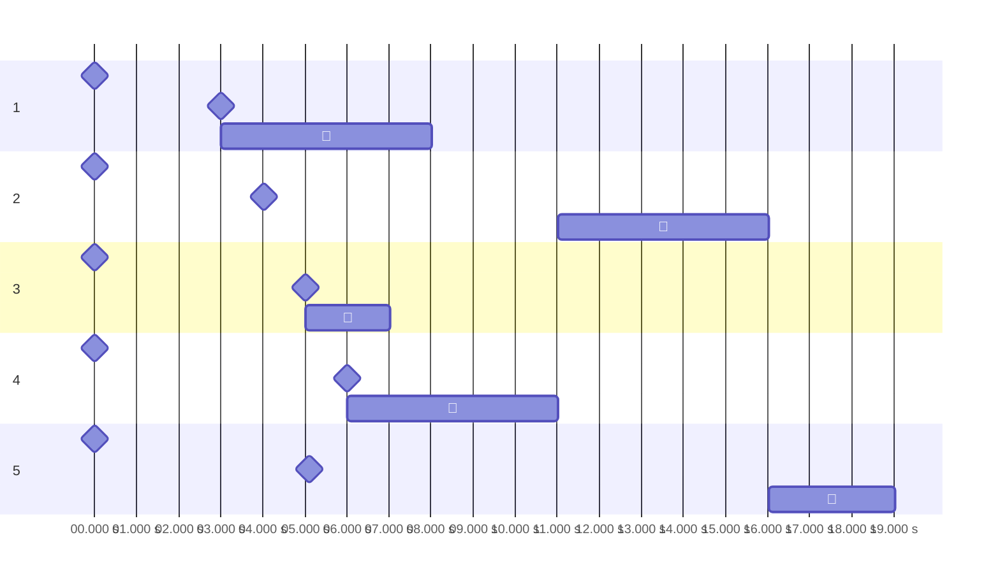
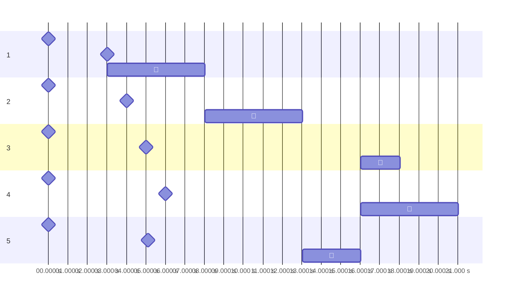
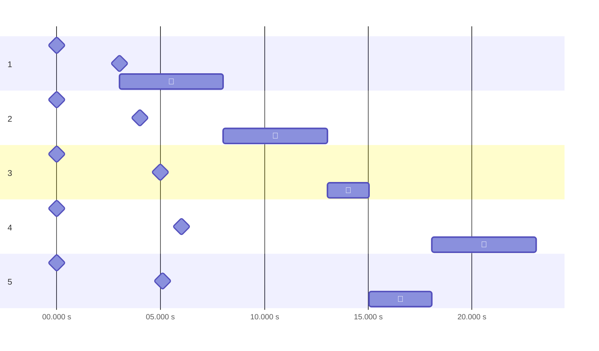

# 实验2 读者写者问题

## 实验内容

在Windows环境下，创建一个控制台进程，此进程包含n个线程。用这n个线程来表示n个读者或写者。每个线程按输入的要求进行读写操作。用信号量机制分别实现读者优先和写者优先问题。

运行结果显示要求：要求在每个线程创建、发出读写申请、开始读写操作和结束读写操作时分别显示一行提示信息，以确定所有处理都遵守相应的读写操作限制。

## 实验目的

1. 通过编写和调试程序以加深对进程、线程管理方案的理解。
2. 熟悉Windows多线程程序设计方法。

## 实验基础知识

### 读者—写者问题

读者—写者问题读写操作的通用限制：

- 写—写互斥：不能有两个写者同时进行写操作。

- 读—写互斥：不能同时有一个线程在读，而另一个线程在写。

- 读—读允许：可以有一个或多个读者在读。

附加限制：

- **读者优先**：读者申请时，只要已有其它读者正在读，则它可直接开始操作，不理会写者的请求。
- **写者优先**：一旦有写者申请，任何新读者都必须先等待。
- **公平竞争**：所有操作者都要在`service`的等待队列中排队，从而保证公平。

## 实验设计方法

### 结构设计

### 功能设计

### 软件流程图

## 实验结果及数据分析

### 读者优先

```powershell
> cat .\test_cases\mixed.in | cargo run -- read-preferring --tab 10
 0.000 s |          #1：🚀创建。
 0.000 s |                                        #4：🚀创建。
 0.000 s |                              #3：🚀创建。
 0.000 s |                    #2：🚀创建。
 0.000 s |                                                  #5：🚀创建。
 3.013 s |          #1：🔔👀申请读取。
 3.013 s |          #1：🏁👀开始读取。
 4.008 s |                    #2：🔔📝申请写入。
 5.004 s |                              #3：🔔👀申请读取。
 5.004 s |                              #3：🏁👀开始读取。
 5.103 s |                                                  #5：🔔📝申请写入。
 6.007 s |                                        #4：🔔👀申请读取。
 6.007 s |                                        #4：🏁👀开始读取。
 7.012 s |                              #3：🛑👀结束读取。
 8.017 s |          #1：🛑👀结束读取。
11.016 s |                                        #4：🛑👀结束读取。
11.016 s |                    #2：🏁📝开始写入。
16.028 s |                    #2：🛑📝结束写入。
16.028 s |                                                  #5：🏁📝开始写入。
19.033 s |                                                  #5：🛑📝结束写入。
```



### 写者优先

```powershell
> cat .\test_cases\mixed.in | cargo run -- write-preferring --tab 10
 0.000 s |          #1：🚀创建。
 0.000 s |                              #3：🚀创建。
 0.000 s |                    #2：🚀创建。
 0.000 s |                                        #4：🚀创建。
 0.000 s |                                                  #5：🚀创建。
 3.009 s |          #1：🔔👀申请读取。
 3.009 s |          #1：🏁👀开始读取。
 4.010 s |                    #2：🔔📝申请写入。
 5.003 s |                              #3：🔔👀申请读取。
 5.101 s |                                                  #5：🔔📝申请写入。
 6.012 s |                                        #4：🔔👀申请读取。
 8.022 s |          #1：🛑👀结束读取。
 8.022 s |                    #2：🏁📝开始写入。
13.026 s |                    #2：🛑📝结束写入。
13.026 s |                                                  #5：🏁📝开始写入。
16.031 s |                                                  #5：🛑📝结束写入。
16.031 s |                              #3：🏁👀开始读取。
16.031 s |                                        #4：🏁👀开始读取。
18.041 s |                              #3：🛑👀结束读取。
21.033 s |                                        #4：🛑👀结束读取。
```



### 公平竞争

```powershell
> cat .\test_cases\mixed.in | cargo run -- unspecified-priority --tab 10
 0.000 s |          #1：🚀创建。
 0.000 s |                    #2：🚀创建。
 0.000 s |                              #3：🚀创建。
 0.000 s |                                        #4：🚀创建。
 0.000 s |                                                  #5：🚀创建。
 3.009 s |          #1：🔔👀申请读取。
 3.009 s |          #1：🏁👀开始读取。
 4.007 s |                    #2：🔔📝申请写入。
 5.001 s |                              #3：🔔👀申请读取。
 5.104 s |                                                  #5：🔔📝申请写入。
 6.019 s |                                        #4：🔔👀申请读取。
 8.019 s |          #1：🛑👀结束读取。
 8.019 s |                    #2：🏁📝开始写入。
13.044 s |                    #2：🛑📝结束写入。
13.044 s |                              #3：🏁👀开始读取。
15.050 s |                              #3：🛑👀结束读取。
15.050 s |                                                  #5：🏁📝开始写入。
18.054 s |                                                  #5：🛑📝结束写入。
18.054 s |                                        #4：🏁👀开始读取。
23.077 s |                                        #4：🛑👀结束读取。
```



## 总结

## 附录

程序清单及说明。（列出文件名及说明即可，不需要在此处复制代码，代码直接以源文件形式提供，但源文件中对代码要有必要的注释和说明）
