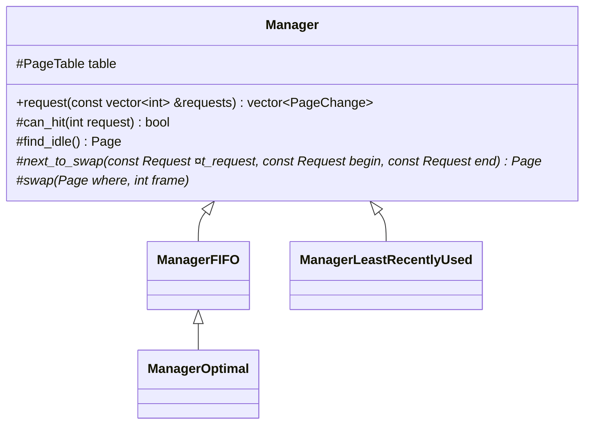
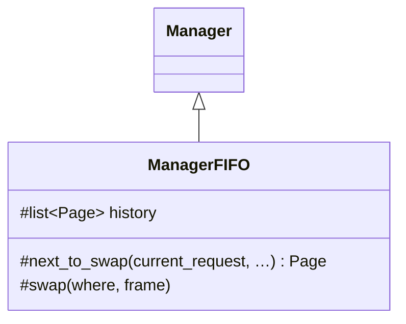
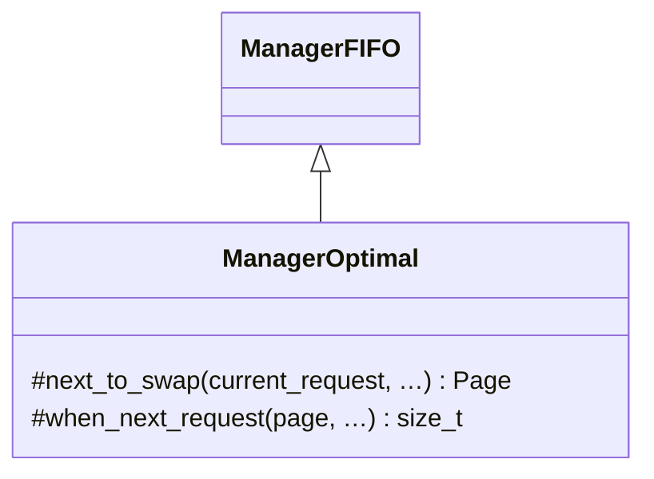

# 实验3 请求页式存储管理

## 实验内容

编写一个请求页式存储管理程序，模拟请求页式存储管理方式下的内存分配和页面置换。

## 实验目的

内存管理是操作系统中的核心模块，能够合理利用内存，在很大程度上将影响到整个计算机系统的性能。内存的分配和回收与内存管理方式有关。

本实验要求学生独立设计并实现请求页式存储管理方式下的内存分配与页面置换模拟程序，以加深对页面置换算法和请求页式存储管理方式的理解。

## 实验基础知识

- **存储管理**

  存储管理需要解决分配、重定位、保护、扩充和共享问题。

- **请求页式存储管理**

  把主存划分成一系列等大的物理页框，给每个进程分配若干整的物理页框，体现为逻辑页面。

  请求逻辑页面时，若内容尚未读入主存，会发生“缺页中断”，待读入后重新运行。

  读入时，若没有空物理页框可分配，需要用新的内容替换旧有页框，即“页面置换”。

  读入主存相对 CPU 运算很慢，页面置换算法最好尽量降低缺页次数。

## 实验设计方法

### 总体设计

#### 结构

首先针对输入输出设计结构。

> 以下如无说明，皆为`struct`。

逻辑页面号全部用`int`表示。

- **输入方面**

  - 页面置换策略`Policy`。（枚举）
  - 输入`Input`。

  ```mermaid
  classDiagram-v2
      class Input {
          Policy policy 页面置换策略
          unsigned int n_frames 物理页框数量
          vector~int~ pages 页面请求序列
      }
  ```

  ```c++
  enum Policy {
      Optimal = 1,
      FirstInFirstOut = 2,
      LeastRecentlyUsed = 3,
  };
  ```

- **输出方面**

  - “页表”`PageTable`（`vector<int>`的别名）。

    ==索引是物理页框号，内容是逻辑页面号==，`IDLE`（`-1`）表示空闲。

    > 页表用于重定位，逻辑页面 → 物理页框；而这里的`PageTable`记录存储情况，是反过来映射（物理页框 → 逻辑页面），严格来说并非页表。（但我想不出更好的名字）

  - 页面更改`PageChange`。

  - 输出`vector<PageChange>`。

  ```mermaid
  classDiagram-v2
      class PageChange {
          PageTable table 更改后的“页表”
          bool hit 是否命中
      }
  ```

#### 功能和流程


1. **`read_inputs`**

   从`stdin`读入数据，验证合法性，解析为`Input`。

   ```mermaid
   flowchart
   创建[创建 input: Input]
   --> in_policy
   --> in_n_frames[输入 input.n_frames]
   --> in_pages
   --> return[返回 input]
   
   subgraph in_policy[输入 input.policy]
       输入整数 --> 断言["断言：编号合法"] --> set_policy["input.policy = Policy(policy)"]
   end
   
   subgraph in_pages[输入 input.pages]
      buffer[创建 buffer: string]
      --> getline["读取至下一逗号，写入 buffer"]
      -->|成功| stoi[解析 buffer 为整数]
      --> push["追加到 input.pages 末尾"]
      --> getline
      
      getline -->|失败| 结束循环
   end
   ```

   > 其中输入`input.pages`时，使用`getline(cin, buffer, ',')`实现。

2. **匹配要求的策略**

   用`switch`–`case`匹配，==实例化相应`Manager`子类==。

   如果输入非法，调用`not_implemented()`向`stderr`报错并结束程序。

   ```c++
   Manager *manager = nullptr;
   
   switch (input.policy) {
   case Policy::□□:
       manager = new Manager□□(input.n_frames);
       break;
   ……
   }
   ```

   > 这个`manager`指针会在`main()`结尾`delete`。

3. **模拟请求页面**

   `Manager`子类==各自实现了`request`方法==，这里调用即可。

   ```c++
   auto changes = manager->request(input.pages);
   ```

4. **`write_outputs(changes)`**

   遍历`changes`，按格式输出页面变化情况，==记录缺页次数==并打印。

   ```mermaid
   flowchart TB
   初始化计数器 --> for --> out_n[输出 n_page_faults]
   
   subgraph 初始化计数器
       direction TB
       init_n_page_faults[n_page_faults = 0]
       init_is_first_change[is_first_change = true]
   end
   
   subgraph for[用 c 遍历 changes]
       direction TB
   
       输出分隔符 --> out_table --> 输出缺页情况 --> 计数[n_page_faults += !c.hit]
   
       subgraph 输出分隔符
           is_first_change{is_first_change}
           -->|true| set_is_first_change[is_first_change = false]
           is_first_change
           -->|false| sep["输出 /"]
       end
   
       subgraph out_table["输出“页表”：用 i 遍历 c.table"]
           idle{i == IDLE} -->|"✓"| 输出- --> 输出,
           idle -->|"✗"| 输出i --> 输出,
       end
       
       输出缺页情况["输出缺页情况：输出 c.hit ? 1 : 0"]
   end
   ```

### 页面置换策略设计

#### 公共

设计虚基类`Manager`，每种策略分别实现它，`main()`再实例化它们。



- **构造函数**

  根据要求的物理页框数`n_frames`初始化`table`，全部用`IDLE`填充——一开始所有块都空闲。

- **响应页面请求`request(requests) → changes`**

  这是暴露给使用者的唯一方法。它输入请求序列`requests`，输出每次更改情况`changes`。

  ==无论是哪种页面置换策略，`request`逻辑都完全相同==，如下。

  ```mermaid
  flowchart TB
      init[创建空 changes: vector&ltPageChange>]
      --> for
      --> return[返回 changes]
      
      subgraph for[用 r: Request 遍历 requests]
          direction TB
  
          can_hit{"能否命中<br>can_hit(*r)"}:::crit
          -->|hit| push[向 changes 记录当前 table 和命中情况]
  
          can_hit
          -->|miss| find_["查找空闲块<br>where = find_idle()"]:::crit
          -->|找到了| swap["直接存储或置换<br>swap(where, *r)"]:::crit
          --> push
          
          find_
          -->|没找到| next["选择要置换的页框<br>where = next_to_swap(r, …)"]:::crit
          --> swap
      end
      
  classDef crit fill:orange;
  ```

  > `r`的类型是`vector<int>::const_iterator`。我为了方便理解，起了别名`Request`。

- **判断请求能否命中`can_hit(request) → bool`**

  > “命中”指当前物理页框已包含请求的逻辑页面，即不缺页。

  遍历查找当前`table`即可。

  ```mermaid
  flowchart
      for --> false[return false]
  
      subgraph for[用 p 遍历 table]
          if{p 满足 request} -->|"✓"| true[return true]
          if -->|"✗"| 继续遍历
      end
  ```

- **查找空闲块`find_idle() → Page`**

  输出`table`中首个空闲物理页框的指针（实际是`PageTable::iterator`，`Page`是它的别名）；若无空闲块，返回`table.end()`。

  > 这里的`Page`指物理页框，而非逻辑页面——这里存储的“页表”`table`与一般意义的页表相反，于是变量名也跟着相反了。

  遍历查找即可。

  ```mermaid
  flowchart
      begin["p = table.begin()"]
      --> while{p 是否空闲}
      -->|"✗"| inc[++p]
      --> while
  
      while -->|"✓"| return[返回 p]
      while -->|已遍历完| return[返回 p]
  ```

  > 遍历完时`p == table.end()`，直接返回即可。

- **查找要置换的页框`next_to_swap(current_request, …) → Page`**

  这是==每种置换策略的区别所在==，因此是纯虚函数。

  有些策略除了关注当前请求，还会参考前后其它请求，所以需要传入整个请求序列。具体来说，`next_to_swap()`除了要求`current_request`（`const Request &`），还要求请求序列`requests`的收尾（`begin`、`end`）。

- **直接存储或置换`swap(where, frame)`**

  输入要存储的位置`where`（“页表”`table`中的“指针”，即物理页框）和要存储的逻辑页面号`frame`，更改`table`。

  说得这么复杂，其实方法里只有一条语句：

  ```c++
  virtual void swap(Page where, int frame)
  {
      *where = frame;
  }
  ```

  所有置换策略的`swap`相同，但有些策略需要加钩子（在`swap`前后做点~儿~什么），所以还是声明成了虚函数。

#### 先进先出`ManagerFIFO`

要记录“谁先来”，所以需记录历史`history`（当前使用的物理页框的链表，`list<Page>`，按照使用先后排列）。



- **`next_to_swap`**

  先进先出，直接`return this->history.front()`即可。

- **`swap(where, frame)`**

  除了置换，还要记录历史——来时追加，替时删除。

  ```mermaid
  flowchart
      if{"*where ≠ IDLE"}
      -->|"✓<br>这次是置换"| remove_["history.remove(where)"]:::crit
      --> swap[按原来 swap]
      --> push["history.push(where)"]:::crit
  
      if -->|"✗<br>这次是直接存储"| swap
  
  classDef crit fill:orange;
  ```

#### 最佳`ManagerOptimal`



> `ManagerOptimal`继承`ManagerFIFO`的原因之后会解释。

- **逻辑页面到下次请求的轮数`when_next_request（page, …) → size_t`**

  最佳算法要置换未来“最晚用到的”逻辑页面，因此需计算到下次请求的轮数。（若此后再无请求，则返回到结尾的轮数。）

  传入请求序列`requests`，向后遍历查找`page`即可。（实际传入的是请求序列的两个“指针”：`current_request`和`end`。）

  ```mermaid
  flowchart LR
      init_round[round = 0]
      --> init
  
      subgraph 向后遍历查找
          init[r = current_request]
          --> while{"r ≠ end ∧<br> *r ≠ page"}
          -->|"✓"| inc[round++<br>++r]
          --> while
      end
  
      while -->|"✗"| return[返回 round]
  
  ```

请求快到结尾时，可能有多种选择（很多页面都不会再请求，`when_next_request`返回值相同），且缺页次数相同。这时最佳算法有多种，本次实验规定按先进先出置换。因此，`ManagerOptimal`也需记录历史——我们==直接继承`ManagerFIFO`==就好啦。

> 还没到结尾时，存在下次请求。假如有多个页面的`when_next_request`相同，那么它们的“下次请求”会是同一次，矛盾。故多解只存在于结尾。
>
> FIFO、LRU 只关心过去，不关心未来，没有类似情况。

- **`next_to_swap`**

  挑`when_next_request`最大的置换，相同时先来的优先。

  使用擂台法寻找，按照来的顺序（遍历`history`）打擂台。

  ```mermaid
  flowchart
      init["best_page = history.front()<br>best_rounds = when_next_request(*best_page, …)"]
      --> for
      --> return[返回 best_page]
      
      subgraph for[用 p 遍历 history]
          calc["r = when_next_request(*p, …)"]
          --> if{r > best_rounds}
          -->|"✓"| update[best_page = p<br>best_rounds = r]
          if -->|"✗"| 继续
      end
  ```

#### 最近最久未用`ManagerLeastRecentlyUsed`

最近最久未用策略和最佳策略精神一致，只是从“未来”改成了“过去”。

- **逻辑页面到上次请求的轮数`when_prev_request（page, …) → size_t`**

  和`ManagerOptimal`的`when_next_request`类似，只需`end`↦`rbegin`，`++r`↦`--r`。

  > 实际传入`begin`，然后`rbegin = prev(begin)`。

- **`next_to_swap`**

  和`ManagerOptimal`的类似，但这里没有`history`，应当遍历`table`。

  ```mermaid
  flowchart
      init["best_page = table.begin()<br>best_rounds = when_prev_request(*best_page, …)"]
      --> for
      --> return[返回 best_page]
      
      subgraph for[用 p 遍历 table]
          calc["r = when_prev_request(*p, …)"]
          --> if{r > best_rounds}
          -->|"✓"| update[best_page = p<br>best_rounds = r]
          if -->|"✗"| 继续
      end
  ```

## 实验结果及数据分析

## 总结

## 附录

程序清单及说明。（列出文件名及说明即可，不需要在此处复制代码，代码直接以源文件形式提供，但源文件中对代码要有必要的注释和说明）
