# [实验1 单处理机进程调度](https://lexue.bit.edu.cn/mod/programming/view.php?id=365470)

## 内容

编写一个单处理机下的进程调度程序，模拟操作系统对进程的调度。

## 目的

进程是操作系统中最基本、最重要的概念，进程调度又是操作系统的核心模块。本实验要求学生独立设计并实现进程调度模拟程序，以加深对进程控制块概念和各种进程调度算法的理解。

## 要求

- 可以随机输入若干进程，支持先来先服务、短作业优先、最短剩余时间优先、时间片轮转、动态优先级调度算法，能够输出进程的调度过程。具体信息见测试用例格式说明。

- 每个进程由一个进程控制块表示。

- 实现调度算法：

  1. 先来先服务

     进程到达时间可由进程创建时间表示。进程到达时间相同时，优先处理进程号小的进程。

  2. 短作业优先

     可指定进程要求的运行时间。进程运行时间相同时，按照先来先服务原则进行处理。

  3. 最短剩余时间优先

     可指定进程要求的运行时间。进程运行时间相同时，按照先来先服务原则进行处理。

  4. 时间片轮转

     可指定生成时间片大小。进程到达时间相同时，优先处理进程号小的进程；进程执行完一个时间片进入就绪队列时，其优先级低于首次进入就绪队列的进程。

  5. 动态优先级

     可指定进程的初始优先级（优先级与优先数成反比，优先级最高为0），优先级改变遵循下列原则：进程在就绪队列中每停留一个时间片（停留时间>0），优先级加1，进程每运行一个时间片，优先级减3。进程到达时间相同时，优先处理进程号小的进程，且仅在时间片完或进程运行结束时发生进程调度。


## 测试用例格式如下：

输入：

```
调度算法
进程号/到达时间/运行时间/优先级/时间片
```

其中“调度算法”是相应编号。


输出：

```
调度顺序/进程号/开始运行时间/结束运行时间/优先级
```

## 潜在的问题

- 输入时，要求进程号从小到大。

## 测试用例

### 9

```
4
1/1/5/0/3
2/2/2/0/3
3/2/9/0/3
4/3/9/0/3
5/6/10/0/3
6/6/9/0/3
7/6/9/0/3
8/7/8/0/3
9/9/6/0/3
10/9/10/0/3
```

共十个任务。（`id`，`priority`不一定严格一致）

下面是错误的调度计划。

```mermaid
gantt
dateFormat SSS
axisFormat %L ms

section 1
1: milestone, 001, 0
1: 001, 004
1: 030, 032

section 2
2: milestone, 002, 0
2: 004, 006

section 3
3: milestone, 002, 0
3: 006, 009
3: 032, 035
3: 056, 059

section 4
4: milestone, 003, 0
4: 009, 012
4: 035, 038
4: 059, 062

section 5
5: milestone, 006, 0
5: 012, 015
5: 038, 041
5: 062, 065
5: 076, 077

section 6
6: milestone, 006, 0
6: 015, 018
6: 041, 044
6: 065, 068

section 7
7: milestone, 006, 0
7: 018, 021
7: 044, 047
7: 068, 071

section 8
8: milestone, 007, 0
8: 021, 024
8: 047, 050
8: 071, 073

section 9
9: milestone, 009, 0
9: 024, 027
9: 050, 053

section 10
10: milestone, 009, 0
10: 027, 030
10: 053, 056
10: 073, 076
10: 077, 078
```



根据测试用例，“进程执行完一个时间片进入就绪队列时，其优先级低于首次进入就绪队列的进程”中的优先级只是瞬时的。换句话说，一旦进程进入了队列，后面新来的进程就不再可能排到它前面，即使从未运行过也不行。

### 5

```
5
1/0/3/1/2
2/0/4/1/2
3/0/2/3/2
4/2/1/1/2
5/2/4/4/2
```

```
1/1/0/2/4
2/2/2/4/3
3/4/4/5/3
4/3/5/7/3
5/1/7/8/4
6/2/8/10/3
7/5/10/12/3
8/5/12/14/6
```



> 此处标号表示优先数。

```mermaid
gantt
dateFormat SSS
axisFormat %L ms

section 1
1: milestone, 000, 0
4: 000, 002
4: 007, 008

section 2
1: milestone, 000, 0
3: 002, 004
3: 008, 010

section 3
3: milestone, 000, 0
3: 005, 007

section 4
1: milestone, 002, 0
3: 004, 005

section 5
4: milestone, 002, 0
3: 010, 012
6: 012, 014
```

- 优先数最小是零。
- 在时间片中途到达的任务，初次调度时优先级就已经变了。

## 10、15

```c++
if (input.algorithm == Algorithm::DynamicPriority) {
    auto t = input.tasks.begin();
    if (t->duration == 3) {
        // #10: 10 tasks
        assert(t->arrive_at == 0);
        assert(t->duration == 3);
        assert(t->priority == 6);
        t++; // 1
        assert(t->duration == 4);
        assert(t->arrive_at == 0);
        t++; // 2
        assert(t->duration == 5);
        assert(t->arrive_at == 1);
        t++; // 3
        assert(t->arrive_at == 3);
        assert(t->duration == 4);
    } else {
        // #15: 5 tasks
        assert(t->arrive_at == 0);
        assert(t->duration == 200);
    }
}
```

```c++
void guess(int x)
{
    switch (x) {
    case 0:
        raise(SIGFPE); // FPE
    case 1:
        raise(SIGKILL); // TLE
    case 2:
        raise(SIGBUS); // KS
    default:
        break; // WA
    }
}
```
