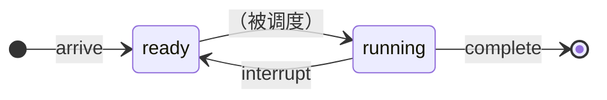

# [实验1 单处理机进程调度](https://lexue.bit.edu.cn/mod/programming/view.php?id=365470)

> 2022年9月12日。

## 内容

编写一个单处理机下的进程调度程序，模拟操作系统对进程的调度。

## 目的

进程是操作系统中最基本、最重要的概念，进程调度又是操作系统的核心模块。本实验要求学生独立设计并实现进程调度模拟程序，以加深对进程控制块概念和各种进程调度算法的理解。

## 要求

- 可以随机输入若干进程，支持先来先服务、短作业优先、最短剩余时间优先、时间片轮转、动态优先级调度算法，能够输出进程的调度过程。具体信息见测试用例格式说明。

- 每个进程由一个进程控制块表示。

- 实现调度算法：

  1. 先来先服务

     进程到达时间可由进程创建时间表示。进程到达时间相同时，优先处理进程号小的进程。

  2. 短作业优先

     可指定进程要求的运行时间。进程运行时间相同时，按照先来先服务原则进行处理。

  3. 最短剩余时间优先

     可指定进程要求的运行时间。进程运行时间相同时，按照先来先服务原则进行处理。

  4. 时间片轮转

     可指定生成时间片大小。进程到达时间相同时，优先处理进程号小的进程；进程执行完一个时间片进入就绪队列时，其优先级低于首次进入就绪队列的进程。

  5. 动态优先级

     可指定进程的初始优先级（优先级与优先数成反比，优先级最高为0），优先级改变遵循下列原则：进程在就绪队列中每停留一个时间片（停留时间>0），优先级加1，进程每运行一个时间片，优先级减3。进程到达时间相同时，优先处理进程号小的进程，且仅在时间片完或进程运行结束时发生进程调度。


## 测试用例格式

输入：

```
调度算法
进程号/到达时间/运行时间/优先级/时间片
```

其中“调度算法”是相应编号。


输出：

```
调度顺序/进程号/开始运行时间/结束运行时间/优先级
```

## 现有程序潜在的问题

- 输入时，要求进程号从小到大。

## 从测试用例推知的信息

### 时间片轮转

“进程执行完一个时间片进入就绪队列时，其优先级低于首次进入就绪队列的进程”中的优先级只是瞬时的。换句话说，一旦进程进入了队列，后面新来的进程就不再可能排到它前面，即使从未运行过也不行。

### 动态优先级

- 优先数最小是零。
- 在时间片中途到达的任务，初次调度时优先级就已经变了。
- “进程到达时间相同时，优先处理进程号小的进程。”假如优先级相同而到达时间不同，仍然处理先到达的进程。换句话说，比较顺序是优先级 → 到达时间 → 进程号。

## 重新分析

由于这里所有进程都仅有一段 CPU 计算，不会出现中断，可忽略“等待”，从而简化进程状态。

如下图，这里只采用`ready`、`running`两种状态，能触发三种事件引起调度，调度时会把某个进程从`ready`转为`running`。



```c++
enum EventType {
    /** [*] → ready */
    Arrive,
    /** running → ready */
    Interrupt,
    /** running → [*] */
    Complete,
};
```

这里的事件不可取消（一旦加入`events`，就不允许再删除）。
